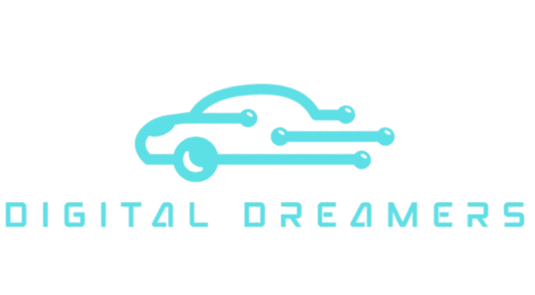

    

    

## 🚗 Digital Dreamers

This project aims to create a realistic car rental platform with a sleek interface, intuitive features, and essential tools like vehicle search, booking, and reservation management, ensuring a smooth user experience.

## 🌐 Project Overview

This web-based car rental platform lets users browse vehicles, book rentals easily, and manage reservations, showcasing web development skills in a realistic service simulation.

## 🛠️ Features

- 🗓️ Pick rental dates
- 📄 View detailed car information(soon)
- 🔐 Login and registration(soon)

 ## 💻 Technologies Used
<table>
  <tr>
    <td></td>
    <td></td>
    <td></td>
  </tr>
</table>
