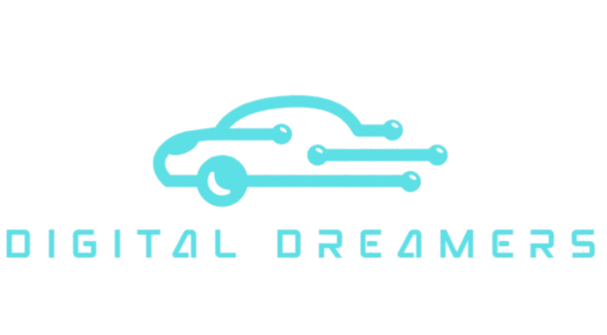

    

## 👨‍💻Digital Dreamers
This web-based car rental platform lets users browse vehicles, book rentals easily, and manage reservations, showcasing web development skills in a realistic service simulation.

## 📘 Overview
This web-based car rental platform lets users browse vehicles, book rentals easily, and manage reservations, showcasing web development skills in a realistic service simulation.

## 🛠️ Technologies Used
<table>
  <tr>
    <td></td>
    <td></td>
    <td></td>
    <td></td>
  </tr>
</table>

## 📄 Pages Included
- **Home Page** – Introduction to the car rental service
- **Car Information Pages** – Display of available vehicles with details
- **Booking Page** – Form for customers to book a car  (soon)
- **About Us** – Information about the service or company  (soon)
- **Contact Page** – Form to reach out for inquiries or support  (soon)

## 🎯 Features
- Pick rental dates
- Clean and responsive design
- Easy navigation between pages
- Booking form with basic validation
- Footer with contact info, navigation to the other pages and social media links
- LogIn and Register

## 📅 Date
April 2025

## 📌 Notes
This project was created for educational purposes only and is not intended for commercial use.
